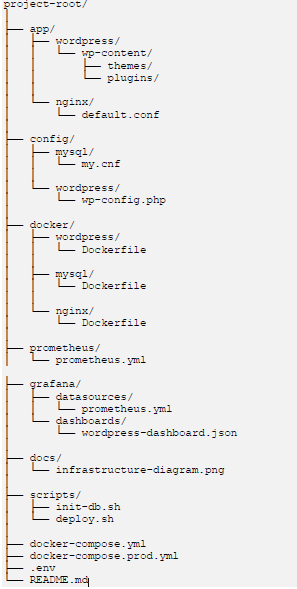

# Projet-I347
## Auteurs
SI-CA2a \
Ahmet Karabulut, David Galindo

## Objectifs
- Configurer une plateforme d'exécution containerisée 
- Automatiser le déploiement de l'infrastructure et des services
- Installer et configurer les services requis de manière sécurisée 
-  Mettre en production l'application web et sa base de données
  
## Étapes du projet
### 1. Configuration de l'environnement Docker 
   - Créer un fichier `docker-compose.yml` pour définir les services
   - Utiliser des images officielles pour Wordpress, MySQL et Nginx
   - Créer un Dockerfile personnalisé pour l'application web
### 2. Automatisation avec Infrastructure as Code 
   - Écrire un script Bash pour automatiser le déploiement 
   - Utiliser Docker Compose pour orchestrer les conteneurs 
   - Implémenter des variables d'environnement pour la configuration
### 3. Configuration sécurisée des services
   - Configurer Nginx comme reverse proxy avec HTTPS 
   - Mettre en place des règles de sécurité pour la base de données 
   - Implémenter des bonnes pratiques de sécurité Docker
### 4. Mise en production 
   - Créer un script de déploiement pour l'environnement de production 
   - Implémenter une stratégie de sauvegarde pour la base de données 
   - Configurer un monitoring de base avec Prometheus et Grafana

## Structure du projet

## Sources
### Images officielles
Wordpress : https://hub.docker.com/_/wordpress
MySQL : https://hub.docker.com/_/mysql
Nginx : https://hub.docker.com/_/nginx